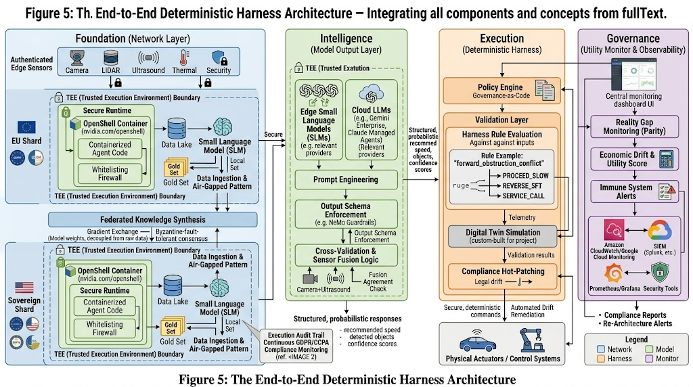
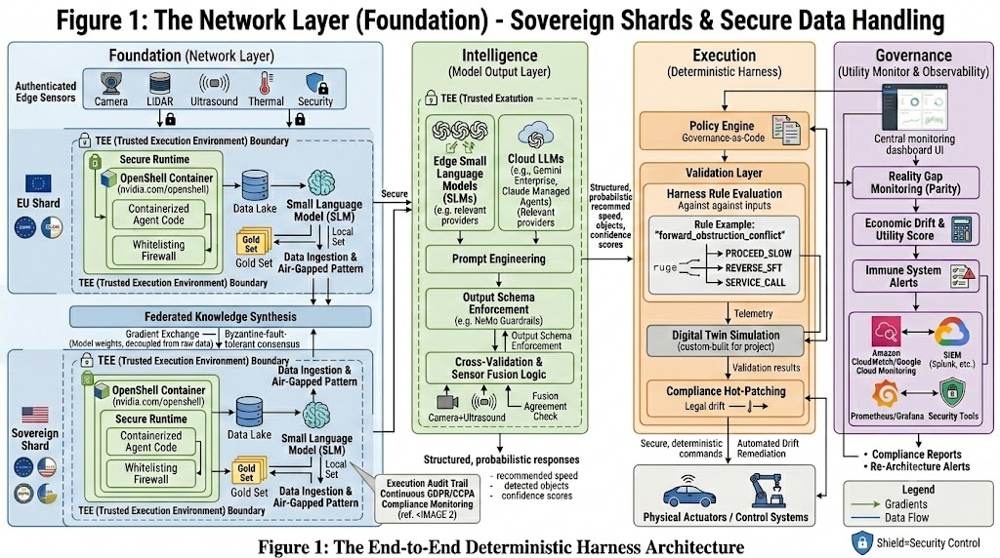
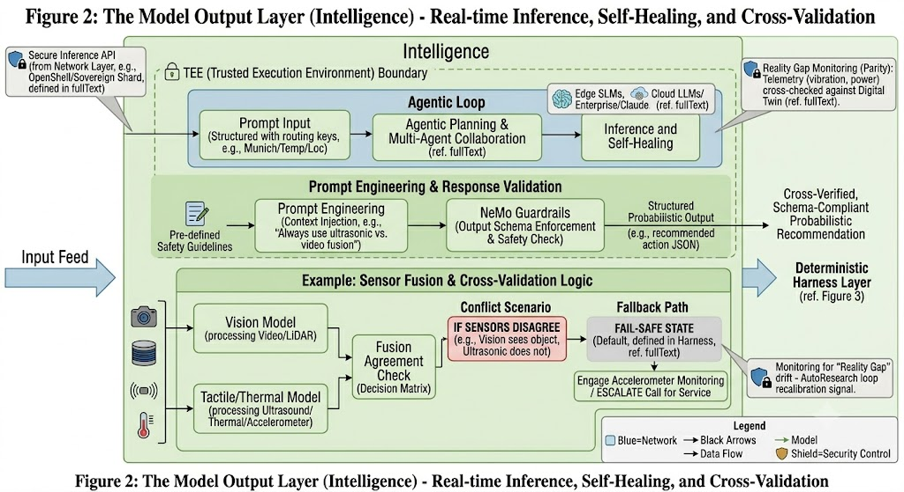
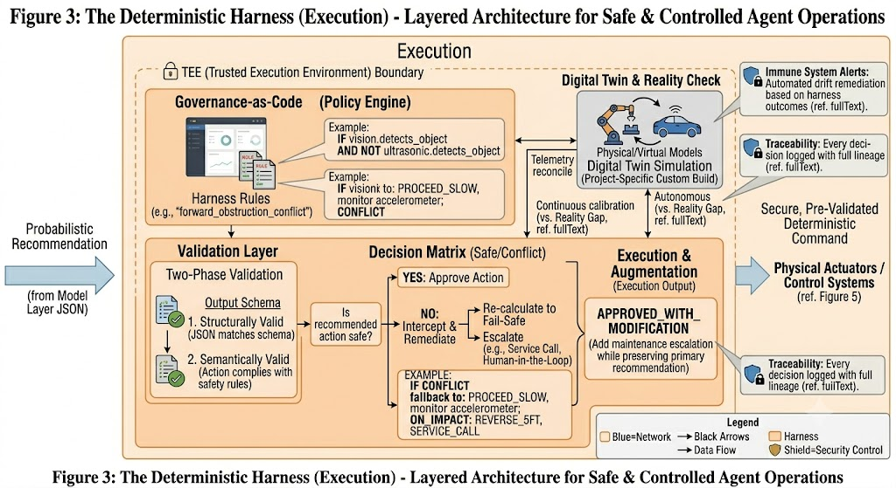
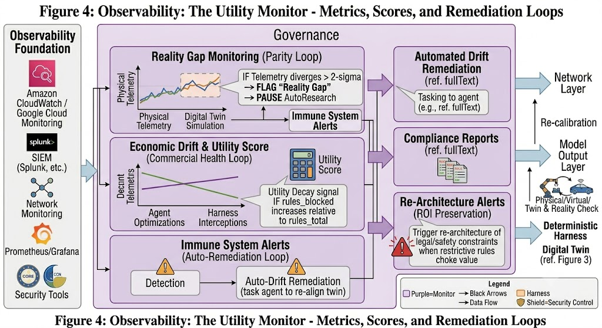

# Deterministic Harness Architecture

A multi-layered architectural pattern for deploying autonomous AI agents in high-stakes or regulated environments — ensuring that while AI systems learn and adapt, their behavior remains predictable, controllable, and legally compliant.

**[Full Technical Architecture Brief](technical_architecture_brief.md)**

---

## Overview

The Deterministic Harness Architecture is built on the principle of **Defense in Depth**, combining four distinct layers that work in concert to govern AI agent behavior from network isolation through to observability.

---

## Architecture Layers

### 1. Network Layer — Isolation and Sovereignty

Isolates agentic activities using **Sovereign Shards** — TEE-backed execution environments that enforce jurisdictional data boundaries. Automated data auditing prevents raw or identifiable data from leaving the sovereign perimeter, and Federated Knowledge Synthesis allows global models to learn from regional data without raw data ever crossing a boundary.

### 2. Model Output Layer — Real-Time Intelligence

Small Language Models (SLMs) at the edge provide low-latency decision-making, cross-validated through **Sensor Fusion** (e.g., video + ultrasound). If sensor streams disagree, the system defaults to a fail-safe state defined in the Harness. NeMo Guardrails and structured prompt engineering ensure consistent, predictable model output.

### 3. Deterministic Harness — Governance as Code

A hard-coded validation layer that wraps every agentic action and enforces the rule set defined at deployment. The Harness transforms probabilistic model outputs into deterministic, auditable decisions. It intercepts policy violations, supports compliance hot-patching for regulatory changes, and logs a full decision lineage for audit.

### 4. Utility Monitor — Observability and Commercial Health

Wraps the entire stack with observability that goes beyond error logging. Tracks **Utility Decay** — the signal that safety constraints have become so restrictive they are blocking commercial value — and triggers a Re-Architecture Alert before the system becomes compliant but useless. Also monitors Reality Gap drift between Digital Twin simulations and production telemetry.

---

## Supporting Documents

| Document | Description |
|---|---|
| [Technical Architecture Brief](technical_architecture_brief.md) | Full architecture specification with diagrams, interface contracts, and design rationale |
| [Network to Model Interface](network-to-model-interface.md) | Interface contract between the network and model output layers |
| [Model to Harness Interface](model-to-harness-interface.md) | Interface contract between the model output layer and the deterministic harness |
| [Failure Mode Matrix](failure-matrix.md) | 12 identified fault modes with detection thresholds and three-tier response protocols |
| [Threat Matrix](threat-matrix.md) | 15 identified threats mapped to architectural controls, including cascading and governance risks |
