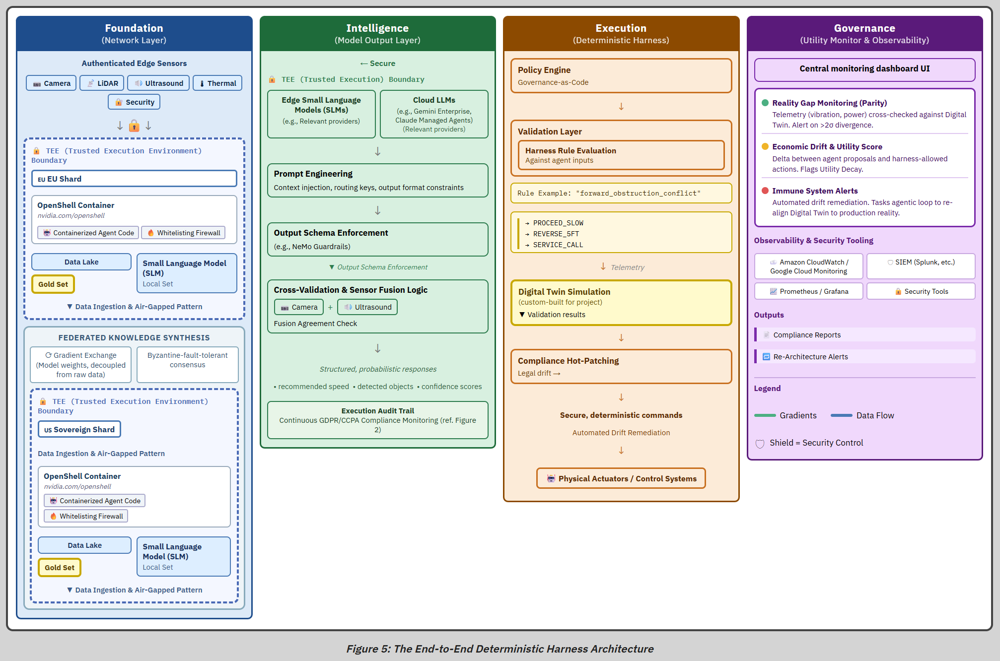
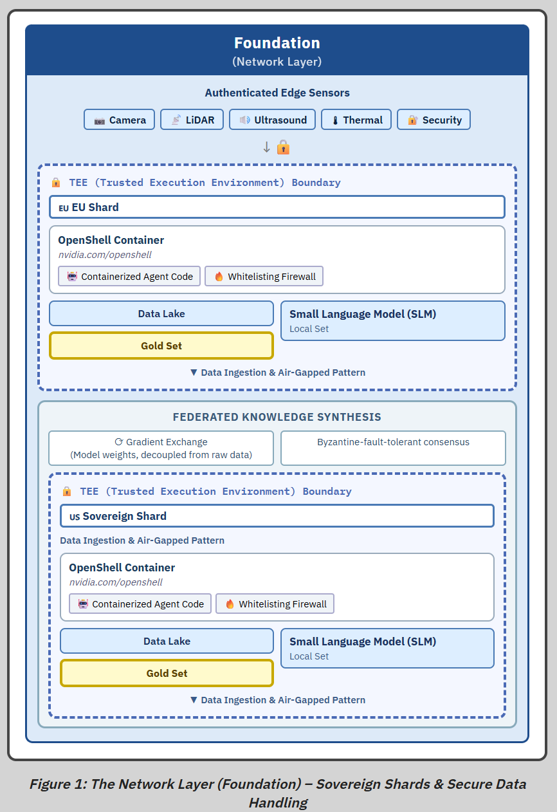
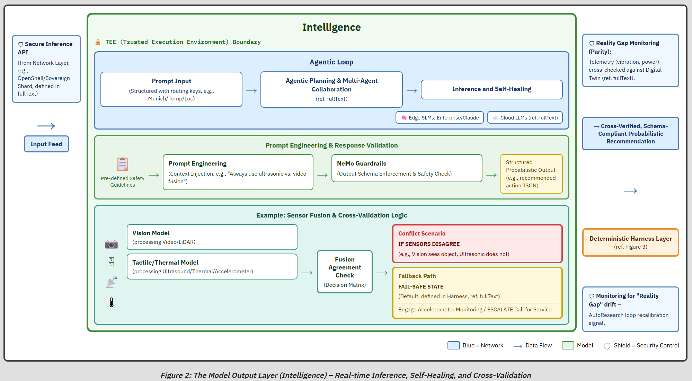
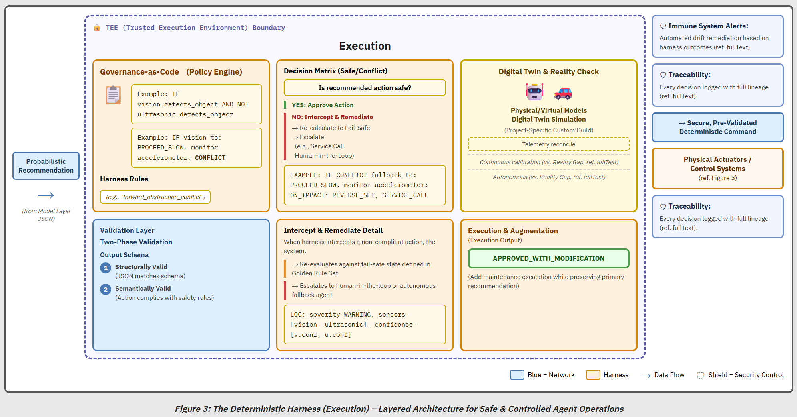
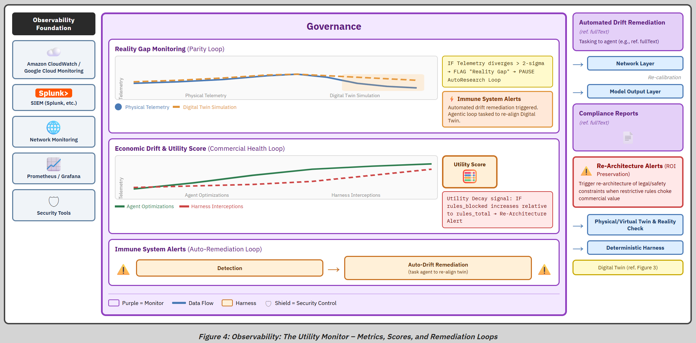

# Deterministic Harness Architecture

A layered architecture for running autonomous AI agents under deterministic safety constraints — a trusted, hard-coded harness that validates and bounds the output of a probabilistic model.

> **Status:** An architectural proposal, not a validated system. There is no production deployment and no empirical benchmark data; any performance figures in this work are design targets, not measurements. See [Status and Validation](technical_architecture_brief.md#status-and-validation) in the brief.

**[Full Technical Architecture Brief](technical_architecture_brief.md)**

---

## Overview

The architecture applies **Defense in Depth** to agentic AI: four layers, each with a distinct job, working together to govern agent behavior from network isolation through to observability. The design intent is to let an agent operate with real autonomy while keeping the parts that must never drift — the safety floor — under deterministic, auditable control.

---

## Architecture Layers

### 1. Network Layer — Isolation and Sovereignty

Isolates agentic activities using **Sovereign Shards** — TEE-backed execution environments that enforce jurisdictional data boundaries. Automated data auditing prevents raw or identifiable data from leaving the sovereign perimeter, and Federated Knowledge Synthesis lets a global model learn from regional patterns without raw data ever crossing a boundary.

### 2. Model Output Layer — Real-Time Intelligence

Small Language Models (SLMs) at the edge provide low-latency decision-making, cross-validated through **Sensor Fusion** (e.g., video + ultrasound). If sensor streams disagree, the system defaults to a fail-safe state defined in the Harness. NeMo Guardrails and structured prompt engineering keep model output consistent and predictable.

### 3. Deterministic Harness — Governance as Code

A hard-coded validation layer that wraps every agentic action and enforces the rule set defined at deployment. The Harness turns probabilistic model output into deterministic, auditable decisions. It intercepts policy violations before execution, supports compliance hot-patching for regulatory changes, and logs a full decision lineage for audit.

### 4. Utility Monitor — Observability and Commercial Health

Wraps the entire stack with observability that goes beyond error logging. It tracks **Utility Decay** — the signal that safety constraints have become restrictive enough to block real commercial value — and triggers a Re-Architecture Alert before the system stops earning its keep. It also monitors Reality Gap drift between the Digital Twin simulation and production telemetry.

---

## What This Architecture Contributes

The harness-over-model pattern is not new. It descends from the [Simplex architecture](https://doi.org/10.1109/MS.2001.936213) (Sha, 2001), from run-time assurance as codified in [ASTM F3269](https://www.astm.org/f3269-21.html), and from [shielding in reinforcement learning](https://ojs.aaai.org/index.php/AAAI/article/view/11797) (Alshiekh et al., 2018). The output-validation mechanism is an instance of policy-as-code ([Open Policy Agent](https://www.openpolicyagent.org/)) and of constrained-output tooling such as [NeMo Guardrails](https://arxiv.org/abs/2310.10501).

Two things set this work apart from those classical formulations:

- **It bounds catastrophic failure rather than guaranteeing safety.** Classical Simplex and RTA assume a formally verified safety controller and a computable safe-recovery region. Those assumptions break down when the high-performance controller is an LLM reasoning over an open-world domain. The harness is positioned to bound failure, not prove safety, and the Failure Mode and Threat Matrices exist to make the residual coverage gaps explicit.
- **The Utility Monitor treats over-restriction as a measured failure mode.** A supervisor so conservative it destroys the system's value is its own failure (Utility Decay). The classical safety-supervisor literature optimizes for safety alone and has no equivalent concept; instrumenting the safety-versus-value tradeoff is where this work aims to add something new.

---

## Supporting Documents

| Document | Description |
|---|---|
| [Technical Architecture Brief](technical_architecture_brief.md) | Full architecture specification with diagrams, interface contracts, and design rationale |
| [Network to Model Interface](network-to-model-interface.md) | Interface contract between the network and model output layers |
| [Model to Harness Interface](model-to-harness-interface.md) | Interface contract between the model output layer and the deterministic harness |
| [Failure Mode Matrix](failure-matrix.md) | 12 identified fault modes with detection thresholds and three-tier response protocols |
| [Threat Matrix](threat-matrix.md) | 15 identified threats mapped to architectural controls, including cascading and governance risks |

---

## Scope

This is a high-level architecture, not a tutorial or a drop-in implementation. The pattern was developed against a single cyber-physical case (CNC thermal monitoring); the layering generalizes to other high-stakes domains — autonomous vehicles, medical diagnosis, financial trading — but the physical-grounding mechanisms (Digital Twin, cross-modal sensor fusion) do not transfer for free. Each new domain must supply its own ground-truth substitute.

Explicitly out of scope: training-time data security, model alignment and underlying capabilities, supply-chain security beyond the network layer, and systematic prompt-level red-teaming.

---

## Contributing

Contributions are welcome. Open an issue for bugs or suggestions, or fork and submit a pull request. Please keep contributions aligned with the project's security and privacy principles.

---

## About the Author

I'm Bob Scheller. I lead enablement platforms at Merck Animal Health, where I hold the founding patent on the Whisper biosensor — an ML-based animal-health monitoring system that became the SenseHub platform now operating across 30+ countries. The work in this repository is personal and independent, and does not represent my employer.

This proposal comes out of a specific kind of experience: shipping a probabilistic ML system into real-world, physically-grounded deployment at scale, and watching where the gap between "the model is usually right" and "the system must never do the wrong thing" actually bites. Sensor disagreement, jurisdictional data boundaries, the slow drift between a model's training distribution and the world it runs in, and the commercial reality that a safety layer too conservative to ship is its own kind of failure — these aren't abstractions to me. The Deterministic Harness generalizes the patterns that mattered in that deployment into an architecture for agentic systems, where both the autonomy and the stakes are higher.

I'm publishing it as a proposal rather than a finished system because I'd rather have the coverage gaps argued over in public than papered over.
